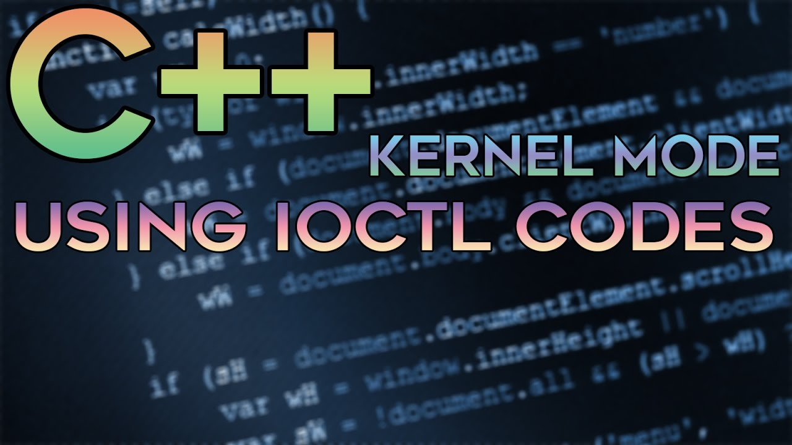

# Read And Write User Mode Process Via Ring0 []
 
###### This project uses a kernel mode driver in co-operation with a user mode program to establish a method of reading / writing virtual memory from a regular win32 program without having to use regular WinAPI Functions. This happens by using a driver to execute the reading / writing of the memory itself from a lower level. This means the user mode program does not have to open any handles to csgo or use ReadProcessMemory or WriteProcessMemory nor any functions that has to deal with process handles.

<h1 align="center">  </h1>

###### VAC’s defence against external cheats is based on system handle scanning on user level. VAC scans handles in the system (ring3), when it finds a handle which for example points to cs:go, the process that holds that handle will be analysed.

###### This can be avoided by not opening any handles to csgo (OpenProcess()), but it also means we can’t use any WinAPI Functions to Read/Write the memory of the process that we want, so we must go to a lower level. As of now, VAC or valve does not have any drivers which means if we can write & get kernel code running defeating vac is possible.

###### Then a scanning thread is created. This thread repeatedly scans all handles in the system (calls NtQuerySystemInformation with SystemHandleInformation information class) for handles to the process its running from and logs any process holding it into the first section object. VAC uses NtQueryInformationProcess with ProcessImageFileName information class to find the image name of the process, tries to open it with NtCreateFile and uses GetFileInformationByHandle to get the volume serial number and the file identifier (it won't change if you rename or move the file).
